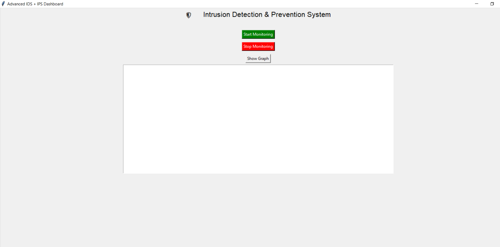
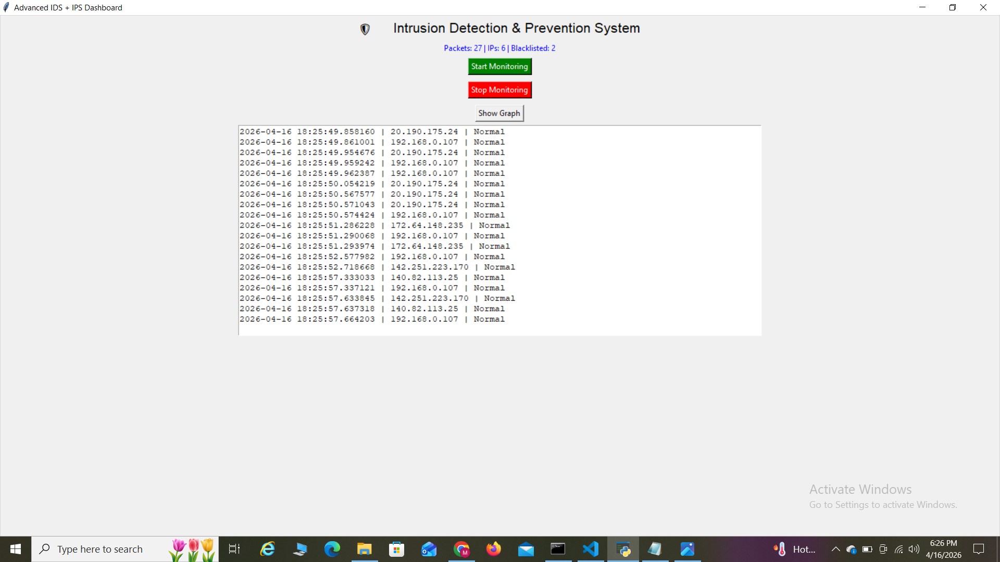
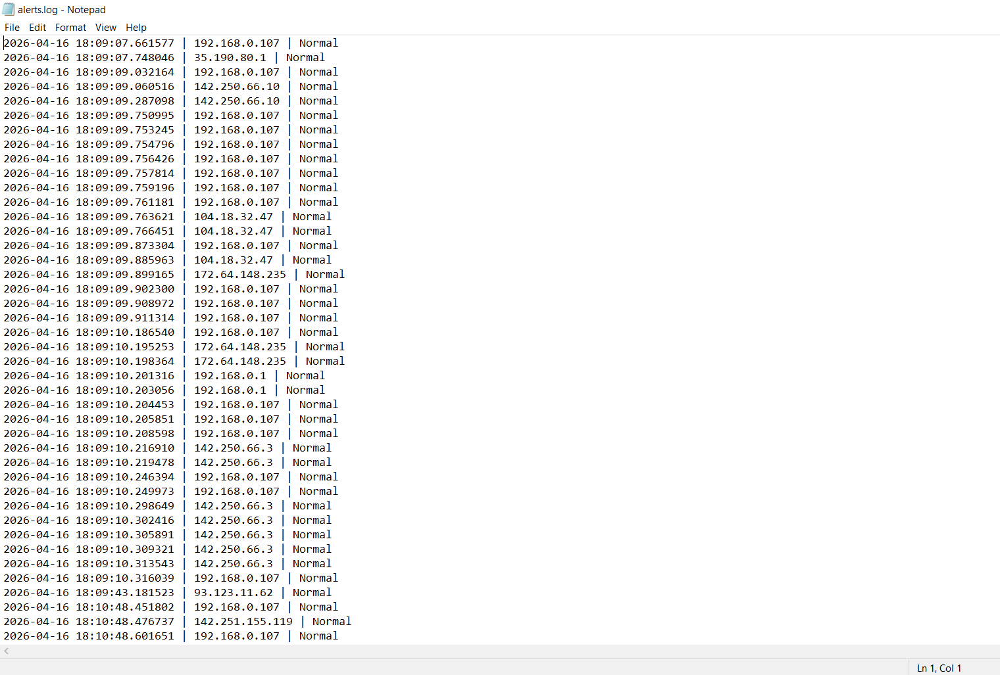

## Advanced Intrusion Detection & Prevention System (IDS/IPS)

## Description
This project is a Python-based Intrusion Detection and Prevention System that monitors network traffic in real time, detects suspicious activity, and automatically blocks malicious IP addresses.

Features
* Real-time packet capture using Scapy
* Attack detection (Port Scanning, DoS patterns)
* Automatic IP blacklisting (IPS functionality)
* GUI-based monitoring dashboard using Tkinter
* Traffic visualization using Matplotlib
* Logging system for security events

##  Technologies Used
* Python
* Scapy
* Tkinter
* Matplotlib

## How to Run
1. Install dependencies:
   pip install scapy matplotlib
2. Run the program:
   python ids.py
   
   
   

## Detection Capabilities
* Detects abnormal packet activity
* Identifies suspicious IP behavior
* Automatically blocks malicious sources
* Displays real-time traffic statistics
   

## Files

* ids.py → Main program
* blacklist.txt → Stores blocked IPs
  
* alerts.log → Stores detection logs
   

##  Note

This project is developed for educational purposes and simulates intrusion detection and prevention behavior.

##  Author

MOHD EHSAN MUZAMMIL
